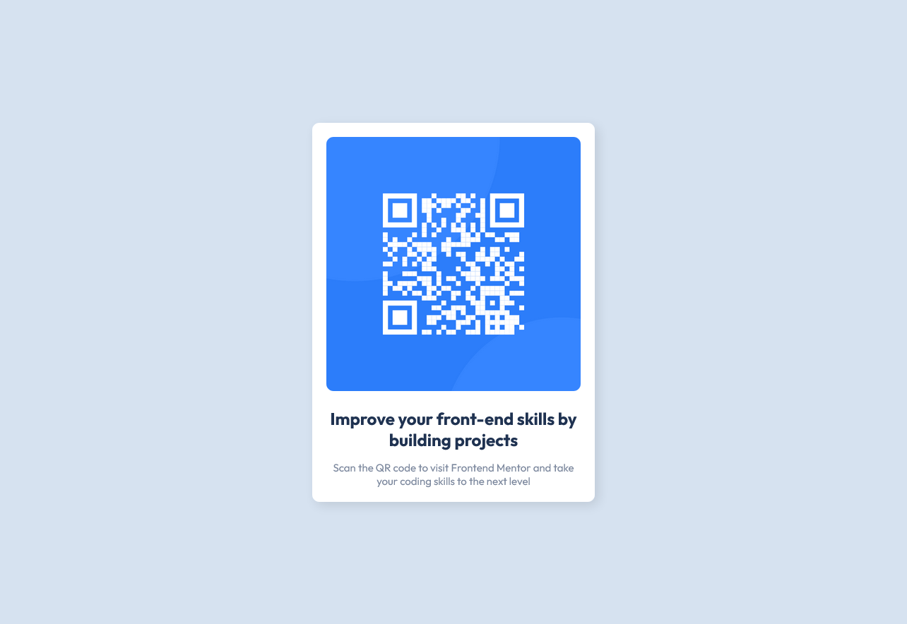

# Frontend Mentor - QR code component solution

This is a solution to the [QR code component challenge on Frontend Mentor](https://www.frontendmentor.io/challenges/qr-code-component-iux_sIO_H). Frontend Mentor challenges help you improve your coding skills by building realistic projects. 

## Table of contents

- [Overview](#overview)
  - [Screenshot](#screenshot)
- [My process](#my-process)
  - [Built with](#built-with)
  - [Continued development](#continued-development)
- [Author](#author)
- [Acknowledgments](#acknowledgments)

## Overview

### Screenshot

## My process

### Built with

- Semantic HTML5 markup
- CSS custom properties
- Flexbox
- Mobile-first workflow
- 

### Continued development

In future projects, I wish to add more interactivity to the website, maybe with dark mode as well as the ability for the user to copy a link to their clipboard as well. As for CSS, I struggled on the usage of media queries, ultimately opting out of using one, and deciding about how to make the height responsive (Spoiler: It isn't.).

## Author

- Frontend Mentor - [@marisfreire](https://www.frontendmentor.io/profile/marisfreire)
- Twitter - [@marixfreire](https://www.twitter.com/marixfreire)

## Acknowledgments

Thanks to the Conquering Responsive Layout course by Kevin Powell that made this insanely easier for me.

